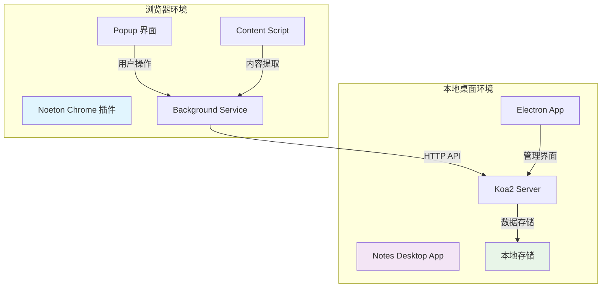

# Web Capture Vault - 智能网页知识管理生态系统

> **Noeton —— Turn web into your knowledge universe**  
> **让网页成为你的理念世界**


## 🌟 项目概述

**Web Capture Vault** 是一个完整的本地知识管理生态系统，包含：
- **🧩 Noeton Chrome 插件** - 智能网页内容采集工具
- **💻 Notes Desktop App** - 本地笔记管理桌面应用

让您轻松收集网页内容，在本地安全地管理知识库，数据完全掌控在自己手中。

### 🎯 核心价值

以柏拉图"可理知世界（Noeton）"为灵感，将网页碎片化信息转化为结构化的个人知识库，实现"从表象到本质"的认知升华。

## 🏗️ 系统架构



## 📦 项目结构

```
web_capture_vault/
├── chrome-extension/              # Noeton Chrome 插件
│   ├── src/
│   │   ├── popup/                 # 弹窗界面 (React + TypeScript)
│   │   ├── background/            # 后台服务
│   │   ├── content/               # 内容脚本
│   │   ├── utils/                 # API 服务与工具
│   │   └── types/                 # 类型定义
│   ├── manifest.json              # 插件配置
│   ├── popup.html                 # 弹窗模板
│   └── README.md                  # 插件专属文档
│
├── notes-desktop-app/             # 本地笔记管理应用
│   ├── src/
│   │   ├── main/                  # Electron 主进程
│   │   ├── renderer/              # React 渲染进程
│   │   ├── server/                # 服务器相关
│   │   ├── preload/               # 预加载脚本
│   │   ├── types/                 # TypeScript 类型
│   │   └── utils/                 # 工具函数
│   ├── simple-server.js           # Express 版本服务器
│   ├── koa-server.js              # Koa2 版本服务器 (推荐)
│   ├── egg-simple-server.js       # EggJS 风格服务器
│   └── README.md                  # 桌面应用专属文档
│
├── README.md                      # 本文档 (项目总览)
└── docs/                          # 项目文档 (可选)
```

## 🚀 快速开始

### 💻 环境要求
- **Node.js** 18+
- **Chrome 浏览器**
- **操作系统**: macOS / Windows / Linux

### 步骤 1: 启动本地服务器

```bash
# 进入桌面应用目录
cd notes-desktop-app

# 安装依赖并启动服务
npm install
npm start
```

✅ 成功启动后显示：`🚀 Koa2笔记本地服务器启动成功！`

### 步骤 2: 安装 Chrome 插件

```bash
# 进入插件目录并构建
cd chrome-extension
npm install && npm run build
```

**Chrome 浏览器安装：**
1. 访问 `chrome://extensions/` 开启"开发者模式"
2. 点击"加载已解压的扩展程序"，选择 `chrome-extension/dist` 文件夹
3. 插件图标出现在浏览器工具栏

### 步骤 3: 开始使用

1. **状态检查** - 点击插件图标，确认显示"本地笔记应用 - 在线"
2. **收集网页** - 在任意网页点击"学习此网页知识"按钮
3. **管理笔记** - 通过本地服务 API 管理笔记内容

## 🎨 核心功能

### 🌐 Noeton Chrome 插件

#### ✨ 智能内容提取
- **🏢 飞书知识库深度解析** - 按 block 协议还原文档结构
- **📄 技术文档智能采集** - 媒体资源通过 Canvas 转存 CDN
- **🧹 通用网页内容清洗** - 去除广告、导航等无关元素  
- **🤖 AI 深度总结** - 结合大模型生成精炼 Markdown

#### 🎯 用户体验
- **🎨 现代化界面** - 优雅的 Popup 和页面蒙层效果
- **⚙️ 灵活配置** - 自定义 API 地址和密钥
- **📱 响应式设计** - 适配不同屏幕尺寸
- **🔄 实时状态** - 显示学习进度和连接状态

### 💻 Notes Desktop App

#### 🏗️ 多服务器架构支持

| 框架 | 文件 | 特点 | 适用场景 |
|------|------|------|----------|
| **Koa2** ⭐ | `koa-server.js` | 现代化、高性能 | **推荐使用** |
| **Express** | `simple-server.js` | 简单直接 | 快速测试 |
| **EggJS** | `egg-simple-server.js` | MVC 架构 | 大型项目 |

#### 📝 笔记管理
- **📚 完整 CRUD** - 创建、编辑、删除、查询笔记
- **📋 Markdown 支持** - 编辑器 + 实时预览
- **📁 文件夹管理** - 多层级目录结构
- **🔍 全文搜索** - 基于内容的智能检索
- **🏷️ 标签系统** - 灵活的分类管理

#### 🔒 本地化优势
- **🔐 数据安全** - 本地存储，完全掌控
- **🚫 隐私保护** - 无需账号，不依赖云服务
- **⚡ 高性能** - 本地响应，速度快
- **📶 离线可用** - 无网络环境正常工作

## 🔌 数据存储 & API

### 💾 存储位置
- **macOS**: `~/Library/Application Support/NotesDesktopApp/`
- **Windows**: `%APPDATA%/NotesDesktopApp/`
- **Linux**: `~/.config/NotesDesktopApp/`

### 🔍 API 接口 (`http://127.0.0.1:3001`)

| 接口 | 功能 | 参数 |
|------|------|------|
| `GET /health` | 健康检查 | - |
| `GET /api/notes` | 获取笔记列表 | `?page=1&limit=20&search=关键词` |
| `POST /api/notes` | 创建笔记 | `{title, content, url?, tags?}` |
| `PUT /api/notes/:id` | 更新笔记 | `{title?, content?, tags?}` |
| `DELETE /api/notes/:id` | 删除笔记 | - |
| `GET /api/search` | 搜索笔记 | `?q=关键词` |
| `GET /api/folders` | 文件夹管理 | - |
| `GET /api/stats` | 统计信息 | - |

### 📡 插件通信协议

**采集数据请求**
```javascript
POST /api/notes
{
  "title": "网页标题",
  "content": "# Markdown 内容\n\n正文...",
  "url": "https://example.com",
  "tags": ["网页收集"],
  "metadata": {"source": "chrome-extension"}
}
```

**服务器响应**
```javascript
{"success": true, "data": {"id": "note-uuid"}, "message": "笔记创建成功"}
```

## 🛠️ 开发指南

### 🧩 Chrome 插件开发

```bash
cd chrome-extension
npm install

# 开发模式
npm run dev        # 监听文件变化
npm run build      # 构建生产版本  
npm run type-check # TypeScript 检查
```

### 💻 桌面应用开发

```bash
cd notes-desktop-app
npm install

# 启动不同服务器
node start

# Electron 开发
npm run dev:main             # 主进程
npm run dev:renderer         # 渲染进程
```

### 🔧 技术栈

**Chrome 插件**
- React 18.2 + TypeScript 5.3
- Webpack 5.89 + Less 4.2
- Chrome Extension API

**桌面应用**  
- Koa2/Express + TypeScript
- Electron（规划中）
- 本地 JSON 存储

## 🧪 测试与验证

### API 测试示例

```bash
# 健康检查
curl http://127.0.0.1:3001/health

# 创建笔记
curl -X POST http://127.0.0.1:3001/api/notes \
  -H "Content-Type: application/json" \
  -d '{
    "title": "测试笔记",
    "content": "# 这是测试内容\n\n测试正文...",
    "tags": ["测试", "API"]
  }'

# 获取笔记列表
curl http://127.0.0.1:3001/api/notes

# 搜索笔记
curl "http://127.0.0.1:3001/api/search?q=测试"

# 获取统计信息
curl http://127.0.0.1:3001/api/stats
```

### 插件测试流程

1. **环境准备**: 确保本地服务器运行
2. **插件安装**: 加载开发版插件到 Chrome
3. **功能验证**: 
   - 检查服务状态显示
   - 测试网页内容采集
   - 验证数据存储
4. **兼容性测试**: 测试不同网站的内容提取效果

## 🚨 故障排除

### 常见问题及解决方案

#### 服务器相关

**问题**: 服务器启动失败
```bash
# 检查端口占用
lsof -i :3001

# 强制结束占用进程
kill -9 <PID>

# 检查 Node.js 版本
node --version  # 应该 >= 18
```

**问题**: 插件连接失败
```bash
# 确认服务器状态
curl http://127.0.0.1:3001/health

# 检查防火墙设置（macOS）
sudo pfctl -sr | grep 3001

# 查看服务器日志
tail -f ~/Library/Application\ Support/NotesDesktopApp/server.log
```

#### 插件相关

**问题**: 插件状态显示离线
- 检查本地服务器是否启动
- 确认端口配置正确（默认3001）
- 查看 Chrome 控制台错误信息

**问题**: 网页内容提取失败
- 某些网站有反爬虫机制
- 检查网页是否完全加载
- 尝试刷新页面后重新采集

#### 数据相关

**问题**: 笔记保存失败
```bash
# 检查数据目录权限（macOS）
ls -la ~/Library/Application\ Support/NotesDesktopApp/

# 修复权限问题
chmod 755 ~/Library/Application\ Support/NotesDesktopApp/
```

**问题**: 数据丢失或损坏
- 检查磁盘空间是否充足
- 备份 `notes.json` 文件
- 重启服务器重新加载数据

## 📊 性能优化

### 服务器性能对比

| 指标 | Express | Koa2 | EggJS风格 |
|------|---------|------|-----------|
| **内存占用** | ~30MB | ~25MB | ~35MB |
| **启动时间** | ~200ms | ~150ms | ~300ms |
| **请求处理** | ~50ms | ~40ms | ~45ms |
| **并发能力** | 中等 | 高 | 高 |

### 优化建议

1. **选择合适框架**:
   - 开发测试 → Express
   - 生产环境 → Koa2 ⭐
   - 企业项目 → EggJS

2. **数据优化**:
   - 定期清理旧笔记
   - 限制单个笔记大小
   - 使用分页查询

3. **网络优化**:
   - 启用 gzip 压缩
   - 实施请求缓存
   - 优化 JSON 序列化

## 🔮 未来规划

### 短期目标 (3-6个月)

- [ ] **完整 Electron 界面**: 可视化笔记管理界面
- [ ] **数据备份恢复**: 自动备份与恢复机制
- [ ] **插件优化**: 提升内容提取准确率
- [ ] **性能优化**: 大数据量下的性能提升

### 中期目标 (6-12个月)

- [ ] **多设备同步**: 基于本地网络的设备间同步
- [ ] **AI 集成**: 接入本地 AI 模型进行内容分析
- [ ] **插件生态**: 支持第三方插件扩展
- [ ] **主题系统**: 自定义界面主题

### 长期愿景 (1-2年)

- [ ] **知识图谱**: 自动构建知识关联网络
- [ ] **移动端应用**: iOS/Android 客户端
- [ ] **云端可选**: 提供可选的云端同步服务
- [ ] **开放生态**: API 开放，支持第三方集成

## 🎨 品牌理念

### 设计哲学

- **Logo 灵感**: 正十二面体、理性之光、洞穴寓言
- **色彩体系**: 深空灰、雅典蓝、科技青
- **交互理念**: 简洁、直观、高效

### 命名来源

**Noeton** 源自希腊语 "Νοητόν"，是柏拉图哲学中"可理知世界"的概念。它代表通过理性思考达到的真实世界，与我们的产品理念"将网页信息转化为个人知识库"高度契合。

## 📄 许可证与贡献

### 开源许可

本项目采用 [MIT License](LICENSE)，允许自由使用、修改和分发。

---

<div align="center">

**🌟 让每一次网页浏览，都成为理念世界的构建之旅 🌟**

[](https://github.com/kulongaaa/web_capture_vault)
[](https://github.com/kulongaaa/web_capture_vault/fork)

</div>