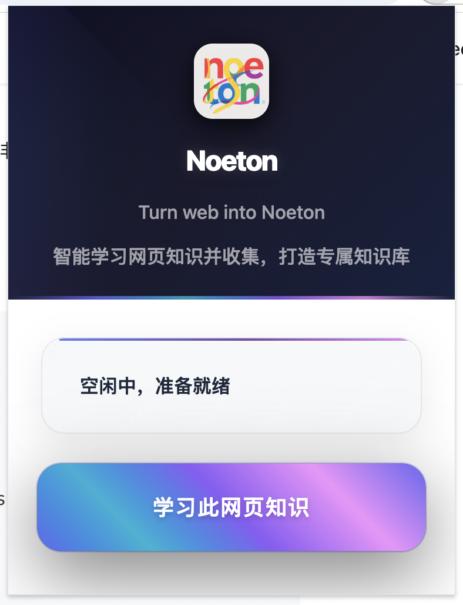

# Noeton 网页学习助手（Chrome 插件）

> **Slogan:**  
> **Turn web into Noeton —— 让网页成为你的理念世界**

## 封面



## 功能特性

- 🎯 **智能内容提取**: 自动提取网页中的文本内容和图片URL
- 🧹 **内容清理**: 智能移除广告、导航、脚本等无用元素
- 🎨 **优雅界面**: 现代化的Popup界面和页面蒙层效果
- ⚙️ **灵活配置**: 支持自定义API地址和密钥配置
- 📱 **响应式设计**: 适配不同屏幕尺寸
- 🔄 **实时状态**: 实时显示学习进度和状态

## 一、项目愿景与未来畅想

Noeton 致力于打造“个人理念世界”的知识采集与管理平台。我们相信，互联网浩如烟海的信息，只有经过结构化、语义化的提炼，才能真正转化为属于每个人的知识体系。未来，Noeton 不仅是网页内容的采集工具，更是你认知升华、知识沉淀的智能伴侣：

- **全端知识库生态**：网页采集、AI整理、内容持久化、跨端同步，构建专属的个人知识宇宙。
- **多源内容深度还原**：无论是飞书知识库、技术文档、还是通用网页，均能最大程度还原原貌，结构化存储。
- **AI驱动的知识升华**：结合大模型（如 DeepSeek），自动总结、归纳、生成高质量 Markdown，助力知识内化。
- **媒体资源智能转存**：图片、代码、表格等富媒体内容一并采集，保障知识的完整性与可用性。
- **理念世界的可视化**：未来将支持知识网络、概念地图等可视化工具，帮助用户洞见知识间的深层联系。

## 二、主题与背景

在信息爆炸的时代，知识的获取不再是难题，难的是如何将碎片化的信息转化为系统化的认知。Noeton 以柏拉图“可理知世界（Noeton Cosmos）”为灵感，强调“从表象到本质”的认知升华。我们希望通过 AI 和现代前端技术，帮助用户将网页上的信息转化为结构化、可检索、可沉淀的个人知识库。

## 三、命名来源

1. 词源与哲学根基
“Noeton” 源自希腊语 “Νοητόν”，是柏拉图哲学体系中 “可理知世界”（Noeton Cosmos）的核心概念。在柏拉图的 “洞穴寓言” 中，“可理知世界” 代表超越感官表象的终极真实 —— 即通过理性（Nous）思考才能触及的 “理念世界”（如正义、美、善的抽象本质）。这一概念强调：知识并非碎片化信息的堆砌，而是通过理性归纳形成的系统化认知结构，与产品 “将网页信息转化为个人知识库” 的功能逻辑高度契合。
2. 与产品功能的隐喻关联
“从表象到本质” 的转化：AI 如同哲学中的 “理性之光”，将网页上的具象信息（文字、图片、数据）提炼为抽象的知识框架（如分类、逻辑链、概念网络），对应柏拉图 “从可见世界（Horaton）到可理知世界（Noeton）” 的认知升华。
“理念世界” 的个人化构建：每个用户的知识库都是独一无二的 “理念集合”，AI 通过收集、整理、关联信息，帮助用户构建专属于自己的 “知识理念王国”，呼应柏拉图对 “真知” 的追求。

## 四、核心功能亮点

### 1. 飞书知识库文档深度还原

- **专属解析协议**：针对飞书知识库，插件会自动识别并按飞书官方 block 协议解析文档结构，最大程度还原原始排版、层级、富媒体内容。
- **结构化存储**：每个 block 作为独立单元存储，便于后续检索、编辑和知识网络构建。
- **高保真 Markdown 输出**：最终生成的 Markdown 文档，尽可能还原飞书原貌，适配个人知识库客户端的展示需求。

### 2. 技术文档与媒体资源智能采集

- **媒体资源转存**：对于市面上常见的技术文档（如 API 文档、博客等），由于版权和授权限制，插件会在前端自动提取 `` 标签资源，通过 Canvas 绘制转存至 CDN，确保图片等媒体内容的可用性和合规性。
- **Markdown 拼装**：所有文本、图片、代码块等内容，最终拼装为高质量 Markdown，便于后续管理和二次创作。

### 3. 通用网页内容智能脱水与总结

- **HTML 脱水清洗**：对其他通用网页，插件会自动去除广告、导航、脚本等无关元素，仅保留核心内容。
- **AI 深度总结**：结合 DeepSeek 等大模型，对提取内容进行语义理解、结构化整理和自动摘要，输出精炼的 Markdown 知识。
- **知识持久化**：所有 Markdown 文档通过 HTTP 服务持久化存储，自动同步到个人知识库客户端，随时随地查阅和管理。

## 五、技术架构与项目结构

- **TypeScript + React**：现代化前端开发，类型安全与高效 UI 体验兼得。
- **Chrome Extension API**：深度集成浏览器能力，实现内容采集与交互。
- **Less + Webpack**：灵活的样式与构建体系。
- **模块化设计**：Popup、Content Script、Background、Utils、Types 分层清晰，便于扩展和维护。

```
web_capture_vault/
├── src/
│   ├── popup/              # Popup界面
│   ├── background/         # 后台服务
│   ├── content/            # 页面内容采集与交互
│   ├── utils/              # HTML处理、API服务
│   └── types/              # 类型定义
├── icons/                  # 插件图标
├── manifest.json           # 插件配置
├── popup.html              # Popup模板
├── package.json            # 依赖管理
├── tsconfig.json           # TypeScript配置
├── webpack.config.js       # 构建配置
└── README.md               # 项目文档
```

## 六、API 规范与数据流

插件会将采集和整理后的内容，通过 POST 请求发送到配置的 API 服务，数据格式如下：

```json
{
  "content": {
    "title": "页面标题",
    "text": "提取的文本内容",
    "images": ["图片URL1", "图片URL2"],
    "url": "页面URL",
    "timestamp": 1234567890
  },
  "metadata": {
    "userAgent": "浏览器用户代理",
    "timestamp": 1234567890,
    "source": "chrome-extension"
  }
}
```

API 响应格式：

```json
{
  "success": true,
  "message": "处理成功",
  "data": {
    "id": "处理结果ID"
  }
}
```

## 七、安装与使用

1. `npm install` 安装依赖
2. `npm run build` 构建生产版本
3. 在 Chrome 扩展页面加载已解压的扩展程序
4. 点击插件图标，配置 API 地址和密钥
5. 打开任意网页，点击“网页学习”按钮，内容即会自动采集、整理并存储到你的知识库

## 八、品牌视觉与哲学

- **Logo 灵感**：正十二面体、理性之光、洞穴寓言，融合古典哲学与现代科技。
- **色彩体系**：深空灰、雅典蓝、科技青，象征理性、智慧与创新。
- **理念延展**：每一次网页采集，都是一次“从表象到本质”的知识升华。

## 九、未来展望

- **知识网络可视化**：支持知识点自动关联、概念地图生成
- **多端同步**：桌面、移动、Web 客户端无缝协作
- **AI 智能问答**：基于个人知识库的语义检索与对话
- **开放生态**：支持插件扩展、第三方 API 集成

---

> **Noeton —— 让每一次网页浏览，都成为理念世界的构建之旅。**
